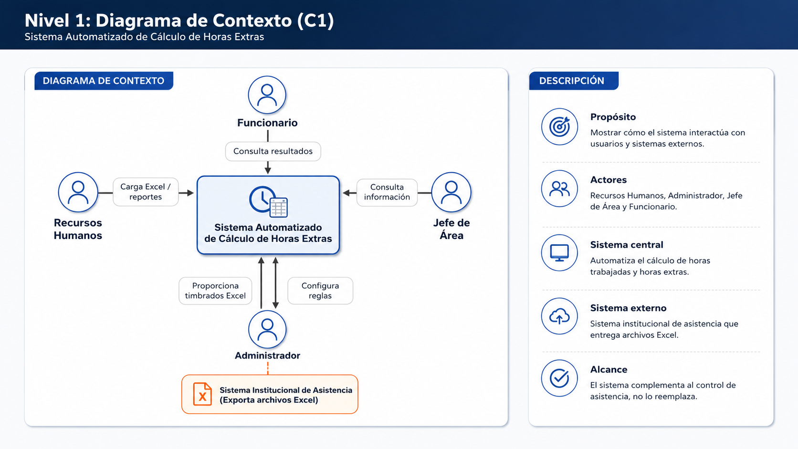
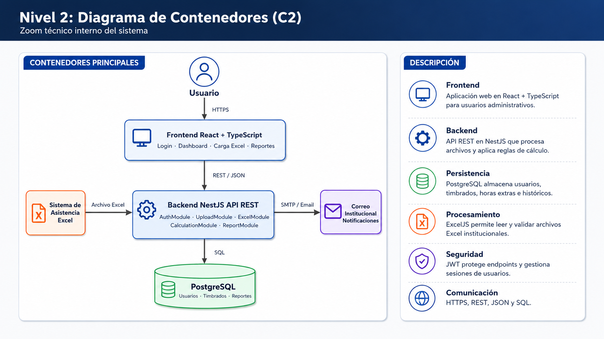

# sistema-horas-extras

## Descripción

Sistema web para automatizar el procesamiento de archivos Excel provenientes del sistema institucional de asistencia, permitiendo calcular horas trabajadas y horas extras de funcionarios.

## Tecnologías

- React + TypeScript
- NestJS
- PostgreSQL
- ExcelJS
- JWT
- Multer

## Modelo C1 - C2

### Nivel 1: Diagrama de Contexto

### Nivel 2: Diagrama de Contenedores

## ADR

- [ADR-001: Uso de PostgreSQL como Base de Datos](ADRS/ADR-001-base-datos-postgresql.md)
